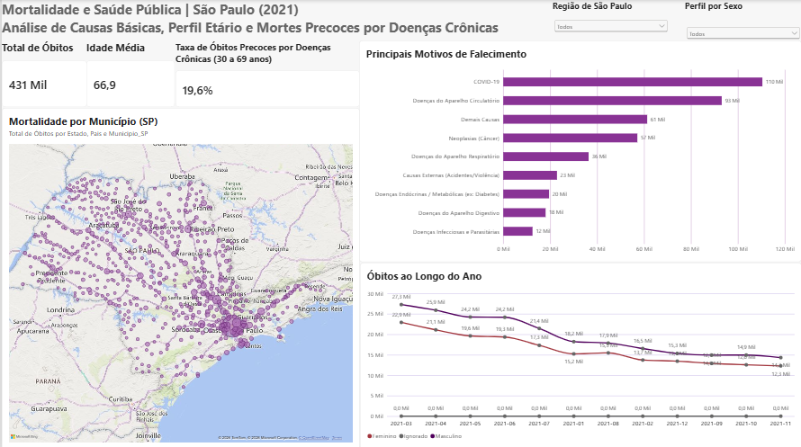

# 📊 Panorama de Mortalidade e Saúde Pública | São Paulo (2021)

Análise epidemiológica e demográfica da mortalidade no Estado de São Paulo durante o ano de 2021, utilizando microdados oficiais do **DataSUS (SIM - Sistema de Informações sobre Mortalidade)** e enriquecimento geográfico via **API do IBGE**.

---

## 📌 Acesso aos Painéis Interativos

- 🌐 **Painel no Tableau Public:** [Acessar Dashboard Interativo no Tableau](https://public.tableau.com/app/profile/jessica.katuki.farias/viz/PanoramadeMortalidadeeSadePblicaSPDataSUS2021/MortalidadeeSadePblicaSoPaulo2021)
- 🖥️ **Visão Geral (Power BI):** [Acessar Arquivo do Power BI](https://github.com/jessicakatuki/panorama-sp-datasus-2021/blob/main/notebooks/dashboard_mortalidade_sp_2021.pbix)



---

## 🎯 Perguntas de Negócio e Saúde Pública Respondidas

Esta análise foi estruturada para responder a 3 questões prioritárias de gestão e epidemiologia:

### 1. Quais foram as principais causas básicas de óbito no Estado de São Paulo em 2021 e qual foi a proporção da pandemia no cenário geral?
- **Achado:** A **COVID-19** figurou como a principal causa de mortalidade em 2021, totalizando **110.395 óbitos (25,6% do total)**.
- **Contexto Clínico:** Logo em seguida surgem as **Doenças do Aparelho Circulatório** com **93.069 óbitos (21,6%)** e as **Neoplasias (Câncer)** com **57.125 registros (13,2%)**, demonstrando a sobrecarga conjunta entre emergência sanitária infecciosa e doenças crônicas no estado.

### 2. Qual foi o impacto das Doenças Crônicas Não Transmissíveis (DCNT) em mortes prematuras (faixa de 30 a 69 anos)?
- **Achado:** A taxa de óbitos precoces por doenças crônicas (30 a 69 anos) representou **19,6% do total de óbitos do estado**, totalizando **84.669 mortes prematuras**.
- **Recorte por Gênero:** A mortalidade prematura por DCNT atingiu proporção maior na população masculina (**20,85%**) em relação à feminina (**18,17%**), evidenciando a necessidade de reforço em estratégias de rastreamento e adesão a cuidados primários de saúde entre os homens.

### 3. Como se comportou a sazonalidade e a curva de mortalidade ao longo dos meses de 2021?
- **Achado:** O pico de mortalidade ocorreu no primeiro quadrimestre do ano (março e abril de 2021), acompanhando a segunda onda epidêmica no estado, com uma tendência constante de declínio a partir do segundo semestre de 2021, correlacionada ao avanço da cobertura vacinal em São Paulo.

---

## 🛠️ Tecnologias e Metodologia

- **Linguagem & Bibliotecas:** Python (`pandas`, `dbfread`, `pyreaddbc`, `plotly`, `requests`).
- **ETL e Engenharia de Dados:**
  - Download automatizado de microdados brutos em formato `.dbc` via FTP do DataSUS.
  - Conversão e descompressão de arquivos `.dbc` para `.dbf`.
  - Enriquecimento com nomes de municípios e microrregiões consumindo a API de Localidades do IBGE.
  - Agrupamento epidemiológico conforme capítulos da CID-10 e regras de mortalidade precoce recomendadas pela OMS/Ministério da Saúde.
- **Visualização de Dados:** Tableau Desktop / Public e Power BI.

---

## 📂 Estrutura do Repositório

```text
panorama-mortalidade-sp-2021/
│
├── data/
│   └── mortalidade_sp_tableau_agregado.csv
│
├── notebooks/
│   └── pipeline_extracao_tratamento.ipynb
│
├── images/
│   └── dashboard_datasus_sp_2021.png
│
├── README.md
└── .gitignore
